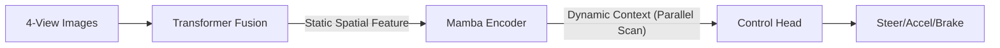

## 1. 프로젝트 요약
🚗 Mamba 기반 End-to-End 자율 주차 시스템
CARLA 시뮬레이터 환경에서 Mamba(State Space Model) 아키텍처를 활용하여 구현한 효율적인 End-to-End 자율 주차 에이전트입니다.

본 프로젝트는 기존의 Transformer 구조보다 연산 효율이 뛰어난 Mamba(Selective State Space Model)를 활용하여 주행 제어 명령을 직접 생성합니다. 복잡한 주차 시나리오에서 센서 데이터를 입력받아 조향(Steering), 가속(Acceleration), 제동(Brake) 값을 실시간으로 예측합니다.

본 모델은 다중 센서 정보를 통합하여 정밀한 주차 제어를 수행하기 위해 다음과 같은 단계별 구조를 가집니다.

1. Multi-View Input (4 Surround Images): 차량 주변을 감시하는 4개의 카메라(전/후/좌/우)로부터 원시 데이터를 입력받습니다.

2. BEV Feature Extraction: 각 카메라의 2D 이미지를 공간 지각력이 극대화된 BEV(Bird's-Eye View) 특징 맵으로 변환합니다. 이는 주차 칸과의 거리 및 정렬 상태를 파악하는 데 핵심적인 역할을 합니다.

3. Feature Fusion: 추출된 각 뷰의 특징들을 하나의 통합된 벡터 공간으로 융합(Fusion)하여 차량 주변 360도 환경을 단일 지표로 재구성합니다.

> [!IMPORTANT]
> ### 4. Mamba Sequence Modeling: 공간 지각과 주행 맥락의 통합
> 트랜스포머에 의해 융합된 특징 시퀀스를 **Mamba(SSM) 블록**에 입력하여 정교한 시퀀스 모델링을 수행한다. 
> 
> * **병렬 연산 최적화:** `Associative Scan` 원리를 이용한 **병렬 스캔(Parallel Scan)** 기법을 적용하여 $O(\log L)$의 복잡도로 데이터를 처리함으로써 연산 효율을 극대화하였다.
> * **Simplified S6 설계 ($B=C$):** 입력 가중치($B$)와 출력 가중치($C$)를 공유하는 구조를 채택하여 파라미터를 효율화하고, 주행 맥락 정보가 제어 신호로 변환될 때의 **일관성과 안정성**을 확보하였다.
> * **동적 맥락 추출:** 트랜스포머가 포착한 정적 공간 특징으로부터 차량의 이동 흐름과 주행 이력을 반영한 **동적 맥락(Driving Context)**을 생성하여 최종 제어 헤드에 전달한다.

5. Control Prediction: 최종적으로 Mamba의 출력값은 제어 헤드를 거쳐 조향(Steering), 가속(Accel), 제동(Brake) 등의 물리적 제어 신호로 변환됩니다.

## 2. Requirement
carla: 0.9.11

python: 3.7

## 3. 결과

NVIDIA RTX 2080 GPU 환경에서 총 30 Epoch 동안 약 60시간의 학습을 진행하였다.

🏁 주차 성공 판정 기준 

차량의 중심이 주차 칸의 정중앙으로부터 0.5m 이내에 위치해야 하며, 차체가 목표 방향에서 틀어진 각도 오차가 0.5도 미만이어야 한다.

## 4. Dataset

https://pan.baidu.com/s/1PoMSfgZQMnUGlhi7S5fFZw?pwd=2ik6

pretrained model

last.ckpt 구글 드라이브 다운로드

## 5. References

본 프로젝트는 아래 논문의 연구 성과를 바탕으로 구현 및 개선되었습니다.

[E2E Parking: Autonomous Parking by the End-to-end Neural Network on the CARLA Simulator](https://ieeexplore.ieee.org/document/10588551)

